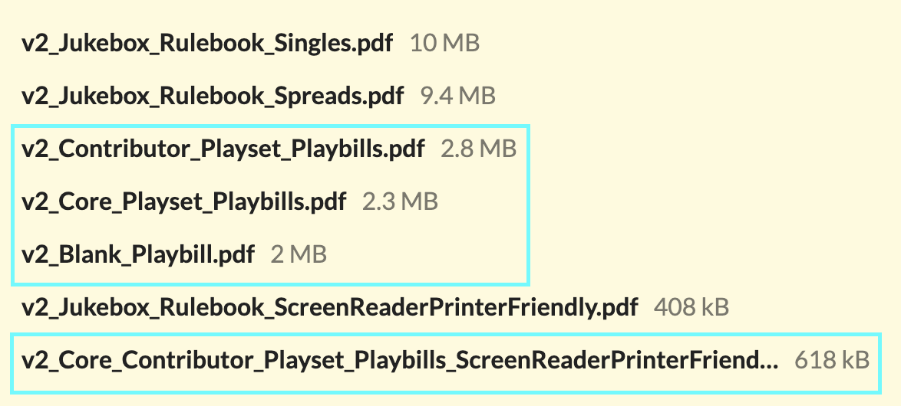

 
# Where do I download and print my playbills for playing Jukebox?

Everyone who purchases a physical copy of Jukebox is entitled to both the PDF of the game, all 16 playsets that come with it, and the blank playbill. Where your PDFs are depends on where you got your copy of Jukebox.

### I backed Jukebox on Kickstarter

If you backed Jukebox at any amount above $10, you got the PDF version of the game. To make as certain as possible folks got the game, it was delivered in two ways:

1. Plus One Experience (who's distributing the physical print copies of the game) emailed out the files.
2. On February 22nd, 2025, everyone received itch.io codes in their emails.

Both of these methods sent codes to the **email address associated with your Kickstarter account**. You can see what email is associated with your account by logging into Kickstarter and got to [https://www.kickstarter.com/settings/account ](https://www.kickstarter.com/settings/account).

If you no longer have access to your Kickstarter email, please reach out via [Kickstarter message](https://www.kickstarter.com/projects/jarofeyes/jukebox-the-karaoke-musical-ttrpg) and let us know your new email so we can officially get you your PDF copy of the game. In the meantime, if you're about to play Jukebox and need access to the print files **now**, you can fill out the [Jukebox Playset and PDF Help Form](https://docs.google.com/forms/d/e/1FAIpQLSe-1j_rUEaTqIHzXNlr_jT-MnRVAyQI2pPP6G25L-TbiT2JuA/viewform?usp=header).

### I bought Jukebox on itch.io
Log in to itch.io and navigate to [https://jarofeyes.itch.io/jukebox](https://jarofeyes.itch.io/jukebox). There, you'll see the list of files associated with the project. The playbills are these files:

You can read a summary of what's included below and in the back of the Jukebox rulebook.

### If you purchased with Plus One Experience:

Plus One Experience will send you the PDFs at the email address you give them. If you're having any trouble, their [contact form and customer support is here](https://plusoneexp.com/pages/contact-us). 

In the meantime, if you're about to play Jukebox and need access to the print files **now**, you can fill out the [Jukebox Playset and PDF Help Form](https://docs.google.com/forms/d/e/1FAIpQLSe-1j_rUEaTqIHzXNlr_jT-MnRVAyQI2pPP6G25L-TbiT2JuA/viewform?usp=header).

### If you purchased with Indie Press Revolution (IPR):

Where you get your PDFs depends on if you bought them online or in-person:
* If you bought Jukebox at a convention from IPR, you will get access to the PDFs via a service called Bits and Mortar. To get this access, find your Square receipt and forward it to the email pdf@indiepressrevolution.com. They will then send you the PDFs via Bits and Mortar.

* If you bought Jukebox from the [IPR website](https://www.indiepressrevolution.com/xcart/Jukebox-The-Karaoke-Musical-Tabletop-Roleplaying-Game-Print-PDF.html) you can downloads from your [IPR account page](https://www.indiepressrevolution.com/xcart/Account.html?mode=preview). If you're having any trouble, email IPR at support@indiepressrevolution.com with the details of your purchase and they'll get you your PDFs!

In the meantime, if you're about to play Jukebox and need access to the print files **now**, you can fill out the [Jukebox Playset and PDF Help Form](https://docs.google.com/forms/d/e/1FAIpQLSe-1j_rUEaTqIHzXNlr_jT-MnRVAyQI2pPP6G25L-TbiT2JuA/viewform?usp=header).

### If you purchased at a physical store:

If the store works with [Bits & Mortar](https://bits-and-mortar.com), then you can and should go through them to get access to your PDF files.

Otherwise keep reading...

### Help! I'm still having trouble and I have a karaoke night to plan!
No worries, fill out the [Jukebox Playset and PDF Help Form](https://docs.google.com/forms/d/e/1FAIpQLSe-1j_rUEaTqIHzXNlr_jT-MnRVAyQI2pPP6G25L-TbiT2JuA/viewform?usp=header). The final page of that form gets you access to all of the playsets immediately and will allow me to follow-up to get you permanent access via itch.io

# What are the available playbills?

Jukebox was published with sixteen original playset playbills and one blank playbill.

### Core Playbills

The following playsets were developed with the game:
* **Epic Warriors of Rock**: A power metal, sword and sorcery playset.
* **High Stakes High School**: A modern musical, youthful pop anthem competition playset. 
* **Space Opera**: An electronic, disco sci-fi playset.
* **Twisted Fairytales**: A Broadway musical folkloric playset. 

### Playset Playbills

These playsets were written by contributing designers: 
* **Fabula Ex Fata**: A folk, acoustic Greek tragedy playset by Basil Wright.
* **Friends…FOREVER?**: A pop-punk, emo campy horror playset by Danny Quach.
* **Hearts Take Flight**: A Motown, funk, R&B teen superhero playset by Jeremy Harper.
* **Light Up the Sky**: A Bollywood, indie rock teen comedy playset by Charu Chandni Patel.
* **Lost in Paradise**: A reggae, alternative, island mystery playset by Brooke Whitney.
* **One Last Job**: A pop, indie heist playset by Devan Wardrop-Saxton.
* **Punk Not Dead**: A punk rock zombie playset by Armanda.
* **Revenge Is Best Served Sung**: A breakup bangers, protest songs, and tragic musicals revenge playset by Ezakur.
* **Romance of the Street Kingdoms**: A Wu-Tang Clan wǔxiá playset by James Mendez Hodes.
* **Shop (In the Name of Love)**: A soul music, love song hallmark movie playset by Erin Roberts.
* **Spirit and Proof**: A 1920s jazz, show tunes, hip hop speakeasy murder mystery playset by C. J. Linton.
* **Swamp Goblins**: A country, blues, backwater monsters fighting eco-terrorism playset by Aaron King.